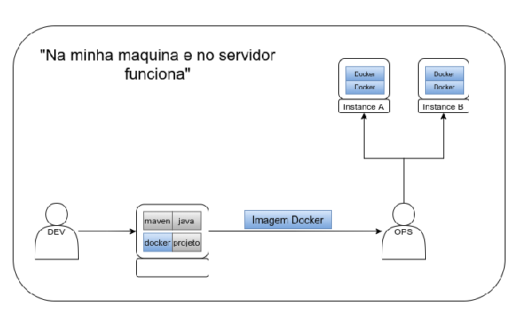

# Talk docker

## O que vamos aprender:

- O que é o docker;
- Solução proposta pelo docker;
- Imagem docker;
- Comandos da imagem docker;
- Iniciando o container docker;
- Volumes do container;
- Portas do container.

## O que é Docker

- Empacotador de Configurações;
- Gerenciado de containers.

## Solução proposta pelo Docker

Sem o docker               |  Com o docker
:-------------------------:|:-------------------------:
  |   

## Imagem Docker

**Comandos Dentro da imagem**

## Container Docker

### Volumes

### Portas